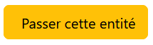
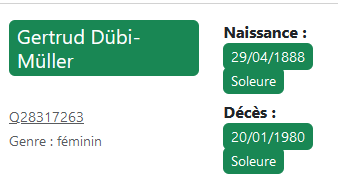
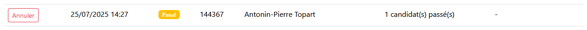

# DOCUMENTATION 2AMO #

# TABLE DES MATIERES #
- [DOCUMENTATION 2AMO](#documentation-2amo)
- [TABLE DES MATIERES](#table-des-matieres)
- [STRUCTURE DE L'APPLICATION](#structure-de-lapplication)
- [FONCTIONNALITES PRINCPIALES](#fonctionnalites-princpiales)
  - [1. Interface de validation](#1-interface-de-validation)
    - [Route /validation](#route-validation)
    - [Route /validation/passer/\<int:tms\_id\>](#route-validationpasserinttms_id)
    - [Route /validation/valider/\<int:tms\_id\>](#route-validationvaliderinttms_id)
    - [Route /validation/refuser-tous-candidats/\<int:tms\_id\>](#route-validationrefuser-tous-candidatsinttms_id)
    - [Fonction get\_entite\_tms](#fonction-get_entite_tms)
    - [Fonction get\_score\_flag\_color\_class](#fonction-get_score_flag_color_class)
    - [Fonction get\_score\_flag\_display\_name](#fonction-get_score_flag_display_name)
    - [Fonction preprocess\_candidat\_info](#fonction-preprocess_candidat_info)
  - [2. Historique](#2-historique)
    - [Route /historique](#route-historique)
    - [Route /annuler\_action/\<int:id\_tms\>/\<string:type\_action\>](#route-annuler_actionintid_tmsstringtype_action)
  - [3. Préférences utilisateur](#3-préférences-utilisateur)
    - [Route /preferences](#route-preferences)
  - [4. Gestion utilisateur](#4-gestion-utilisateur)
    - [Route /inscription](#route-inscription)
    - [Route /connexion](#route-connexion)
    - [Route /deconnexion](#route-deconnexion)
    - [Route /deconnexion\_auto](#route-deconnexion_auto)
    - [Route /changer-mot-de-passe](#route-changer-mot-de-passe)
  - [5. Accueil](#5-accueil)
    - [Route /](#route-)
  - [6. Paramètres globaux de l'application](#6-paramètres-globaux-de-lapplication)
- [DEPLOIEMENT / MISE A JOUR](#deploiement--mise-a-jour)
- [PISTES D'AMELIORATION](#pistes-damelioration)
  - [1. Utilisation de l'API de réconciliation dans l'application](#1-utilisation-de-lapi-de-réconciliation-dans-lapplication)
  - [2. Rajout d'un bouton de choix et validation immédiate sur chaque candidat](#2-rajout-dun-bouton-de-choix-et-validation-immédiate-sur-chaque-candidat)
  - [3. Utilisation du rang des dates ou lieux](#3-utilisation-du-rang-des-dates-ou-lieux)
  - [4. Ajout d'une fonctionnalité de signalement pour les entités TMS](#4-ajout-dune-fonctionnalité-de-signalement-pour-les-entités-tms)
  - [5. Affichage d'une entité TMS spécifique à partir de l'URL](#5-affichage-dune-entité-tms-spécifique-à-partir-de-lurl)
  - [6. Rajout d'une page de recherche d'une entité TMS spécifique](#6-rajout-dune-page-de-recherche-dune-entité-tms-spécifique)
  - [7. Affichage des références et id externes pour les données candidats](#7-affichage-des-références-et-id-externes-pour-les-données-candidats)
  - [8. Le nombre d'id externes comme critère d'affichage des candidats](#8-le-nombre-did-externes-comme-critère-daffichage-des-candidats)
  - [9. Intégration des match préexistants avant l'existence de l'interface de validation dans les entités sélectionnables](#9-intégration-des-match-préexistants-avant-lexistence-de-linterface-de-validation-dans-les-entités-sélectionnables)

# STRUCTURE DE L'APPLICATION
    /Dossier_de_l_application/
    │
    ├── run.py                     # Point d'entrée de l'app (flask run)
    ├── requirements.txt           # Dépendances Python
    ├── README.md                  # Description du projet
    ├── .gitignore                 # Fichiers/chemins à exclure de Git
    │
    ├── /app/                      # Dossier principal de l'application
    │   ├── __init__.py  
    │   ├── app.py                 # Initialisation de l'app Flask
    │   ├── config.py              # Configuration (dev, prod, etc.)
    │   │
    │   ├── /static/               # Fichiers statiques (Bootstrap, CSS, JS...)
    │   │   ├── __init__.py 
    │   │   ├── /css/              # styles CSS
    |   │   │   └── bootstrap.min.css
    |   │   │   └── css_historique.css
    │   │   ├── /js/               # scripts JS
    |   │   │   └── bootstrap.bundle.min.js
    │   │   └── /img/               # scripts JS
    |   │       └── LOGO_MUSEE_ORSAY_H+25MM_NORMAL_NOIR.png 
    │   │
    │   ├── /models/               # Modèles de données et de formulaires 
    │   │   ├── __init__.py        
    │   │   ├── formulaires.py     # FlaskForms (classes pour les formulaires)
    │   │   ├── donnees_A.py     # Modèle de la table extraite du A (ORM)
    │   │   └── base_principale.py # Modèle de la base app_alignement (ORM)
    │   │
    │   ├── /routes/               # Routes
    │   │   ├── __init__.py        
    │   │   ├── generales.py       # Routes générales (accueil, gestion utilisateurs, historique ...)
    │   │   └── validation.py      # Routes liées à la validation ou au refus des candidats
    │   │
    │   └── /templates/            # Templates HTML (Jinja2)
    │       ├── __init__.py
    │       │
    │       ├── /pages/            # Pages complètes
    │       │   ├── __init__.py
    │       │   ├── base.html      # Base de tous les fichiers html de l'application
    │       │   ├── accueil.html      # Page d'accueil
    │       │   ├── validation.html   # Interface de validation
    │       │   ├── historique.html   # Historique de l'utilisateur
    │       │   └── preferences.html  # Paramètre de préférence de l'utilisateur
    │       │
    │       └── /partials/         # Composants HTML réutilisables
    │           ├── __init__.py
    │           ├── head.html      
    │           ├── navbar.html
    │           ├── footer.html
    │           ├── script_de_deconnexion_auto.html # script js de déconnexion automatique
    │           └── /formulaires/  # Templates de formulaires
    │               ├── __init__.py
    │               ├── connexion.html
    │               ├── inscription.html
    │               └── changermdp.html

# FONCTIONNALITES PRINCPIALES

## 1. Interface de validation
### Route /validation
Fonctionnement :
- L'utilisateur doit être connecté
- Sélection de l'entité TMS (id_tms)
- Récupération des candidats correspondants (qid)
- Détermination des couleurs d'affichage des flags pour les données des candidats
- Requête SPARQL Wikidata en fonction du type de chaque candidats (Q5 = humain ou autre)
- Prétraitement des données des candidats
- Tri des candidats par score d'API décroissant

Retourne : 
- render_template de la page validation.html
- donnees (Dict) : données de l'entité TMS sélectionnée pour l'interface de validation
- infos_candidats (Dict) : données du ou des candidats Wikidata correspondant à l'entité TMS sélectionnée

### Route /validation/passer/\<int:tms_id>
Provoqué par : 

Fonctionnement : 
- L'utilisateur doit être connecté
- Passe une entité TMS et enregistre les candidats passés dans l'historique
- Déverrouille l'entité TMS concernée

Méthodes :
- POST

Args :
- tms_id (int): Identifiant de l'entité TMS à passer

Retourne:
- Response: Redirection vers la page de validation avec message flash

### Route /validation/valider/\<int:tms_id>
Provoqué par :

Fonctionnement : 
- L'utilisateur doit être connecté
- Valide les candidats sélectionnés pour une entité TMS et refuse les non sélectionnés
- Enregistre les refus et validations dans l'historique
- Ajoute un `statut_validation` "aligne"
- Déverrouille l'entité TMS concernée

Méthodes :
- POST

Args :
- tms_id (int): Identifiant de l'entité TMS

Retourne :
- Response: Redirection vers la page de validation avec message flash

### Route /validation/refuser-tous-candidats/\<int:tms_id>
Provoqué par :

Fonctionnement : 
- L'utilisateur doit être connecté
- Refuse tous les candidats pour une entité TMS
- Enregistre les refus dans l'historique
- Ajoute un `statut_validation` "non_aligne"
- Déverrouille l'entité TMS concernée

Méthodes :
- POST

Args :
- tms_id (int): Identifiant de l'entité TMS

Retourne :
- Response: Redirection vers la page de validation avec message flash

### Fonction get_entite_tms
Fonctionnement :
- Efface les verrous obsolètes sur les entités TMS
- Récupère la première entité TMS :
  - dont le statut de validation n'est ni "match_communaute", ni "non_aligne", ni "aligne" et n'a pas été passée par l'utilisateur connecté
  - qui n'est pas verrouillée par un autre utilisateur
  - qui respecte les préférences de domaines de l'utilisateur
  - qui a un ou des candidats ayant des score_flag élevés, en priorisant les entités ayant des candidats avec un score_flag de 5, puis 4, etc., jusqu'à -5
  - verrouillage de l'entité tms sélectionnée

Retourne :
- entité (TableTMS) : entité choisi pour l'affichage dans l'interface de validation

### Fonction get_score_flag_color_class
Permet d'afficher le taux de ressemblance d'une donnée candidat par apport aux données TMS : 

Fonctionnement : renvoie la classe CSS bootstrap correspondant à un score_flag_*

Args :
- score_value (int) : valeur du score_flag_*

Retourne : 
- (str) : Classe CSS Bootstrap

### Fonction get_score_flag_display_name
Fonctionnement : renvoie la catégorisation pour chaque score_flag_*
  
Args :
- field_name (str) : nom complet de la colonne score_flag_*

Retourne : 
- (str) : catégorisation formatée pour l'affichage

### Fonction preprocess_candidat_info
Fonctionnement :
- Prétraite les données des candidats pour l'affichage dans l'interface de validation :
  - Si le candidats est un être humain :
    - Dates et lieux de naissance et de mort
    - Occupations
    - type pour l'affichage dans l'interface
    - relations
    - autres labels
    - les différents scores de RelationsTmsCandidats
  - Si le candidat n'est pas un être humain :
    - type pour l'affichage dans l'interface
    - dates de fondation et de dissolution
    - entités l'ayant précédé ou lui ayant succédé dans le temps
    - pays d'appartenance
    - lieux du siège de l'organisation
    - les différents types du candidats
    - description
    - autres labels 

Args : 
- candidat_raw (dict) : Données brutes du candidat
- scores_info (dict) : Informations de scoring depuis RelationsTMSCandidats
- type_candidat (str) : Type du candidat ('Q5' pour personne ou autre)

Retourne : 
- candidat (dict) : Données prétraitées du candidat

## 2. Historique
### Route /historique
Fonctionnement : 
- L'utilisateur doit être connecté
- Pour chaque action de l'utilisateur dans l'historique :
    - regroupement des actions par tms ID
    - Récupération des données :
      - le timestamp de l'action tronqué des secondes et microsecondes
      - l'id TMS
      - le displayname de l'entité tms
      - la liste et le nombre de candidats validés
      - le nombre de candidats refusés
      - le type d'action
    - Si c'est une action "passe" : ajout du nombre de candidats passés
- tri des actions par timestamp décroissants
- gestion de la pagination de l'historique avec la classe CustomPagination

Retourne :
- render_template de la page historique.html
- actions(list) : liste des actions de l'utilisateur avec leurs données
- pagination (CustomPage) : paramètres de pagination

### Route /annuler_action/\<int:id_tms>/\<string:type_action>
Provoqué par :

Fonctionnement : 
- l'utilisateur doit être connecté
- Annule une action de l'utilisateur pour une entité TMS et un type d'actions donnés :
  - supprrime les lignes concernées dans l'historique 
  - si l'action valide/refuse des candidats : supprime le statut de validation de l'entité tms dans `TableTMS`

Méthodes :
- POST

Args : 
- id_tms (int) : ID de l'entité TMS concernée.
- type_action (str) : Type d'action à annuler (ex: "passe" ou "valide_refuse".)

Retourne :
- Si annulé avec succès : 
  - Redirect : vers la page de validation avec message flash de succès et l'id de l'entité TMS de l'action annulée
- Sinon : 
  - Redirect : vers la page historique avec message flash d'erreur.

## 3. Préférences utilisateur
### Route /preferences
Fait fonctionner : 

Fonctionnement : 
- L'utilisateur doit être connecté
- Enregistre les préférences de domaines documentaires de l'utilisateur connecté à partir du formulaire Preferences vers la colonne `preferences` de Utilisateurs.
  > Par défaut, à la création d'un compte, l'utilisateur a pour préférence "tous".
- Récupère des statistiques d'avancement du travail d'alignement par domaines

Méthodes :
- POST
- GET

Retourne :
- render_template pour la page preferences.html
- form (Preferences) : paramètres du formulaire
- stats_domaines (List) : statistiques de l'avancement du chantier d'alignement par nom de domaines documentaires
- Redirect : vers la page preference.html avec message flash de succès
- Si Erreur : message flash d'erreur

## 4. Gestion utilisateur
### Route /inscription
Fait fonctionner :

Fonctionnement :
- Récupère les données du formulaire AjoutUtilisateur
- Vérifie que l'utilisateur n'existe pas déjà
- Enregistre un nouvel utilisateur dans la table Utilisateur

Méthodes :
- GET
- POST

Args :
- Redirect : vers la page d'accueil si l'inscription est un succès (message flash)
- render_template : inscription.html (avec le formulaire)

### Route /connexion
Fait fonctionner : 

Fonctionnement : 
- vérification du statut de connexion de l'utilisateur
- vérifie si l'utilisateur est déjà inscrit
- vérifie la validité de l'adresse mail et du mot de passe
- après validation : connexion automatique du l'utilisateur

Méthodes : 
- GET
- POST

Retourne : 
- Redirect : vers l'interface de validation encas de succès
- render_template : connexion.html (et en cas d'erreur avec messages flash)

### Route /deconnexion
Fonctionnement : déconnecte l'utilisateur s'il est connecté.

Retourne :
- werkzeug.wrappers.Response: Une redirection vers la page d'accueil (avec message de succès flash)

### Route /deconnexion_auto
Fonctionnement : déconnecte l'utilisateur actuel de manière silencieuse au bout d'un certain temps d'inactivité ([voir variables PERMANENT_SESSION_LIFETIME_MINUTES et SESSION_PERMANENT](#6-paramètres-globaux-de-lapplication))

Returns :
- str: Une réponse vide avec le code de statut 204 (No Content).

### Route /changer-mot-de-passe
Fait fonctionner :

Fonctionnement : permet de changer de mot de passe que l'utilisateur soit connecté ou non (en cas d'oubli par exemple)

Méthodes : 
- GET
- POST

Retourne : 
- render_template : changemdp.html (message d'erreur flash si erreur)
- redirect : vers l'interface de validation avec message flash de confirmation 

## 5. Accueil
### Route /
Fonctionnement : affiche la page d'accueil de l'application

Retourne :
- render_template : accueil.html

## 6. Paramètres globaux de l'application
Les variables globales de l'application sont stockées dans le fichier `.env`.

| Nom de la variable | description | type |
| --- | --- | --- |
| SQLALCHEMY_DATABASE_URI | Chemin vers le schema `app_alignement` (base SQL de l'application) sur le serveur Postgre du serveur B | `str` |
| SQLALCHEMY_BINDS_DONNEES_TMS | Chemin vers la table `tms-constituent_constituent-description`, schema `main` (données TMS extraites du serveur A) sur le serveur Postgre du serveur B | `str` |
| DEBUG | Activer et désactiver le Debug Mode de Flask | `bool` |
| SECRET_KEY | Clé secrète d'encryptage et de décrytpage des mots de passe | `str`|
| WTF_CSRF_ENABLE | Activation ou désactivation dui CSRF pour les FlaskForm | `bool`|
| ACTIONS_PER_PAGE | nombre d'actions par pages dans la page /historique | `int`|
| TIMER_INACTIVITE_MINUTES | Nombre de minutes avant le déverouillage d'une entité TMS et la redirection automatique vers l'acceuil | `int` |
| PERMANENT_SESSION_LIFETIME_MINUTES | Nombre de minutes avant la déconnexion automatique et silencieuse | `int` |
| SESSION_PERMANENT | Activer ou désactiver la déconnexion automatique silencieuse | `bool` |

# DEPLOIEMENT / MISE A JOUR

L'application est déployée sur le serveur B, via un serveur Apache à l'URL [https://exemple.url.fr](https://exemple.url.fr).
Voir le [processus de déploiement](https://exemple.url.fr) qui permet de mettre à jour l'application depuis la branche principale du [dépôt Github](https://exemple.url.fr).
> Note : le dépôt Github utilisé pour le déploiement est privé pour des raisons de sécurité (en particulier les variables du .env qui contient des identifiants pour le serveur Postgre du serveur B). Tout compte qui n'aura pas été ajouté en tant que collaborateur ne pourra pas y avoir accès.

# PISTES D'AMELIORATION 
## 1. Utilisation de l'API de réconciliation dans l'application
   
   Permettrait l'utilisation directe du score général de l'API et du score par propriété afin de générer les flags et décider de l'ordre d'affichage des candidats.
   > Note : le calcul des flags devrait alors se faire à la volée. Le choix de priorisation pour les entités TMS à l'affichage devra être revu car calculé en fonction des flags déjà présents dans la base principale.

## 2. Rajout d'un bouton de choix et validation immédiate sur chaque candidat

   Permettrait d'augmenter la cadence de validation, surtout pour les utilisateurs réguliers. 
   > Note : il faudrait alors rajouter un bouton actionnant la route `/validation/valider/<int:tms_id>` pour chaque candidat, en-dessous ou à côté de la case à cocher pour choisir un candidat.

## 3. Utilisation du rang des dates ou lieux
   
   Il a été décidé de garder, dans la base principale de l'application, les rangs Wikidata des dates et lieux des candidats. Nous n'avons pour l'instant pas utilisé ces rangs dans le processus de validation pour les raisons suivantes : 
   
   Les rangs sont généralement présents lorsque plusieurs valeurs pour une même propriété Wikidata existent (ex : plusieurs dates de morts, plusieurs lieux de naissance etc.). Dans ces cas-là, il est donc assez courant qu'une date de rang `deprecated` ne soit pas certes plus la date considérée comme valide scientifiquement aujourd'hui. Cependant, il est tout à fait possible que la date en question ait été utilisée sur une longue période avant d'être réfutée ce qui a pour conséquence sa présence en tant qu'information dans bon nombre de bases de données ou de sources d'autorité, même aujourd'hui. Cela peut-être le cas des dates et lieux pour des entités TMS d'Orsay. Il est donc important de conserver, dans le processus d'alignement et dans l'application à l'affichage, ces dates et lieux même lorsque leur rang est `deprecated` afin de pouvoir comparer le plus justement possible les données, même si elles ne sont plus à jour.
  
   Utilisation possible : 
   - Affichage dans l'interface de validation du rang lorsqu'il y a plusieurs valeurs pour une même propriété si les rangs sont `deprecated` ou `prefered`. Cela permettrait de savoir si une donnée mérite d'être mis à jour ou non sur TMS par la suite par exemple.
   > Note : il faudra alors trouver une manière d'afficher le rang qui ne rende pas l'interface utilisateur confuse (ex : pas par la couleur car pourrait rendre l'affichage des flags moins clairs.)
  
## 4. Ajout d'une fonctionnalité de signalement pour les entités TMS
   Bien que cela changerait quelque peu l'utilité première de l'application, il serait envisageable d'ajouter une menu déroulant ou un autre moyen de signaler une anomalie, un manque de données ou tout autre problème concernant l'entité TMS en cours d'alignement. En effet, l'interface étant conçue pour visionner chaque entité une à une par le personnel scientifique de l'institution, le processus de validation pourrait être l'occasion de signaler de façon détaillée les anomalies éventuelles dans TMS. 
   > Note : Cela donnerait lieu à plusieurs modifications
   >- Modification de la base de l'application pour stocker les signalements (probablement création d'une table dédiée, reliée par les clés étrangères id_tms et id_utilisateur)
   >- Modification de la page de l'interface de validation afin d'y ajouter une manière de signaler l'entité TMS sans perturber la lisibilité de la page.
   >- Création d'un requête SQL / d'une procédure pour faire remonter les signalements aux gestionnaires de la base de donnée

## 5. Affichage d'une entité TMS spécifique à partir de l'URL
  
   Permettrait d'outre-passer le fait que l'utilisateur ait passé une entité sans avoir à annuler l'action manuellement depuis l'historique. Permettrait également de travailler sur une entité donnée. Cette fonctionnalité pourrait être d'autant plus pratique lorsque qu'un import de masse aura été réalisé à l'échelle de toutes les entités personnes et institutions de la base TMS d'Orsay. Il faudra alors modifier la route `/validation` comme ceci :
   - route : `/validation/<int:tms_id>`
   - S'il y a un id_tms dans la route, sélectionner celui-ci et récupérer les candidats associés, effacement du `statut_validation`, effacement des actions liées dans l'historique à l'entité tms. Sinon procéder normalement avec `get_tms_id`
   - Message d'erreur si l'entité est verrouillée par un autre utilisateur, si l'entité n'existe pas / si elle n'est pas encore importée dans la base principale. 
   - Warning si l'entité avait un `statut_validation`= "aligne" qui indique avec quel.s candidat.s l'alignement avait été validé.
  
## 6. Rajout d'une page de recherche d'une entité TMS spécifique
  
   Permettrait la recherche d'un entité TMS via son `displayname` via une recherche plein texte.
   Renverrait une liste des résultats possibles avec un bouton par entité possible qui afficherait l'entité dans l'interface de validation selon le même principe que `/validation/<int:tms_id>` cité dans la proposition précédente. 

## 7. Affichage des références et id externes pour les données candidats 
   
   Références pour chaque valeur de chaque propriété de chaque candidat : 
   
   Cela présenterait un défi de lisibilité dans l'interface de validation mais il serait envisageable d'afficher la source de certaines données importantes afin de que la personnel scientifique puisse évaluer leur fiabilité sans passer par la page Wikidata du candidat. Cela impliquerait probablement une sélection des sources à afficher en amont car il arrive régulièrement que le nombre de références pour une valeur soit important. 

   IDs Externes pour chaque candidat :

   Cette solution présente moins de difficulté en terme de lisibilité pour l'interface de validation. Tout comme l'affichage des références, il faudra tout de même réaliser une sélection des types d'ids souhaités à l'affichage afin de ne pas trop encombrer l'interface. Il serait préférable de les afficher sous forme de lien avec le nom de la source.

## 8. Le nombre d'id externes comme critère d'affichage des candidats
  
   Le nombre d'ids externes d'un candidat pourrait être utilisé comme critère pour faire remonter un candidat dans l'ordre d'affiche lorsqu'il y en a plusieurs avec un score d'API / des score_flag similaires. Cette donnée est déjà stockée dans la base principale dans la colonne `nb_id_externes`. 

## 9. Intégration des match préexistants avant l'existence de l'interface de validation dans les entités sélectionnables
   Consisterait en la non exclusion dans `get_tms_id` des entités ayant un `statut_validation` = match_communaute (actuellement exclues). 

